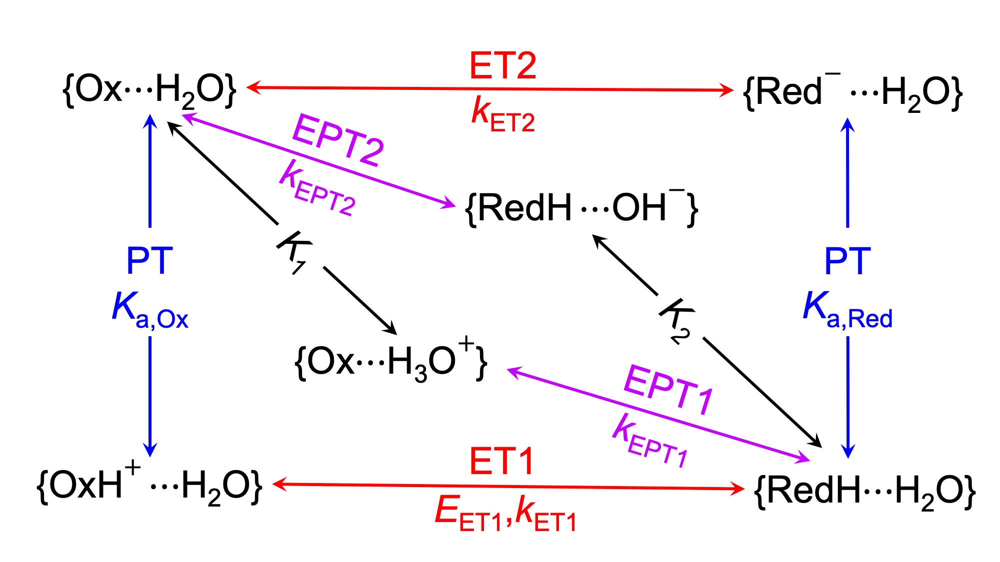

# PCET-pH-kinetic-model
The pH dependence of proton-coupled electron transfer (PCET) reactions is a powerful probe for elucidating their fundamental mechanisms. The PCET-pH-kinetic-model codes a general, multi-channel kinetic model for describing the pH dependence of PCET reactions that can be applied to both homogeneous and electrochemical reactions.  

## Installation 
To use the kinetic model, simply download the code and add it to your `$PYTHONPATH` variable.

## Documentation

### Initialization

#### General consideration
To start a calculation, create a `pHKineticModel` object and input relevant parameters: 
```python
from PCET_pH import pHKineticModel

system = pHKineticModel(KaOx=1e-3, 
                        KaRed=1e-11, 
                        K1=1e2, 
                        K2=1e4, 
                        E_ET1=1.0, 
                        k_ET1=1e4, 
                        k_ET2=1e5, 
                        k_EPT1=1e6, 
                        k_EPT2=1e7, 
                        reaction='reduction', 
                        kinetics='homogeneous',
                        )
```
The `pHKineticModel` object stores all thermodyanmics and kinetics paramaters in the PCET kinetic model, which will be used to calculate the mole fractions, apparent potential and apparent rate constants as functions of pH (and electrode potential). 

The required parameters are listed below:

1. `KaOx` (float or function): acid dissociation equilibrium constant of the oxidized species.

2. `KaRed` (float or function): acid dissociation equilibrium constant of the reduced species.

3. `K1` (float or function): association equilibrium constant of the oxidized species with H3O+.

4. `K2` (float or function): association equilibrium constant of the reduced species with OH-.

5. `E_ET1` (float or function): redox potential of the ET1 channel (in Volts). Note that the other redox potentials will be calculated on-the-fly based on `E_ET1` and the equilibrium constants. 
    
6. `k_ET1`/`k_ET2`/`k_EPT1`/`k_EPT2` (float or tuple): rate constants (and other parameters) of the ET1/ET2/EPT1/EPT2 channel. 
This class can be used to describe both homogeneous and electrochemical reactions. For the later, only Butler-Volmer or Marcus-Gerischer kinetic models are supported. The input format of these `k` parameters varies with the kinetic model choice. 
```
  if reaction = 'homogeneous': k = rate constant (float)

  if reaction = 'Butler-Volmer': k = (standard rate constant, cathodic charge transfer coefficient)

  if reaction = 'Marcus-Gerischer': k = (maximum rate constant, reorganization energy in eV)
```                                               
7. `kinetics` (string): choose among `'homogeneous'`, `'Butler-Volmer'` or `'BV'`, and `'Marcus-Gerischer'` or `'MG'`

8. `reaction` (string): choose between `'reduction'` and `'oxidation'`

These parameters can be summarized in the generalized square diagram of PCET. Detailed definitions are provided in Ref. 1. 
<div align="center">
  
</div>

#### Potential-dependent equilibrium constants
The `pHKineticModel` class also enables the use of potential-dependent equilibrium constants for electrochemical systems. This can be done by setting the `K` parameters to be user-defined functions. For example: 

```python
# define the potential-dependent thermodynamics parameters
def E_ET1_E(E):
    return 0.12*(E-1.1)+1.1

def KaOx_E(E):
    return 10**(-(-0.12*(E-1.1)/0.059+1.2))

# create an instance of the kinetic model and use the pre-defined functions as input parameters
system = pHKineticModel(KaOx=KaOx_E, 
                        KaRed=1e-9, 
                        K1=1e1, 
                        K2=1e3, 
                        E_ET1=E_ET1_E, 
                        k_ET1=(36,0.37), 
                        k_ET2=(12,0.37), 
                        k_EPT1=(12,1.01), 
                        k_EPT2=(12,1.01), 
                        reaction='reduction', 
                        kinetics='MG',
                        )
```

`NOTE`: When using potential-dependent equilibrium constants, KaOx and E_ET1 must be both potential-dependent or potential-independent to ensure the standard free energy of the overall reaction: Ox + H+ + e- <==> RedH is potential-independent. On the other hand, for the other legs, say if KaRed is set to be potential-dependent, the code will automatically make E_ET2 also potential-dependent. 

### Change parameters after initialization
After initialization, the parameters stored in the `pHKineticModel` object can be changed by calling the `set_parameters` method. The syntax is the same as initialization:  

```python
system.set_parameters(KaRed=1e-10,  
                      k_ET2=(12,0.5), 
                      reaction='oxidation', 
                      )
```

### Calculation
With a `pHKineticModel` object created, the mole fractions, apparent potential and apparent rate constants as functions of pH (and electrode potential) can be calculated by simply calling the corresponding methods. 

#### Calculate the mole fractions:
```python
system.calc_mole_fraction(pH) # for systems with potential-independent equilibrium constants
system.calc_mole_fraction(pH, E) # for systems with potential-dependent equilibrium constants
```
By default, this method returns the mole fractions of all species, with the order of: OxH, Ox, Ox...H3O+, RedH, Red, RedH...OH-. The user can also specify one species to calculate its mole fraction using:
```python
system.calc_mole_fraction(pH, species='OxH')
```
Possible choices of the `species` keyword are: `'OxH'`, `'Ox'`, `'OxH3O'`, `'RedH'`, `'Red'`, `'RedHOH'`

#### Calculate the apparent potential:
```python
system.calc_apparent_potential(pH)
```
This method returns the apparent potential. It works for both systems with potential-independent or potential-dependent equilibrium constants. 

#### Calculate the apparent rate constant:
```python
system.calc_apparent_rate_constant(pH) # for homogeneous systems
system.calc_apparent_rate_constant(pH, E) # for electrochemical systems
```
This method returns the total apparent rate constant.

#### Decompose the apparent rate constant:
```python
system.calc_apparent_rate_constant(pH, decomposition=True) # for homogeneous systems
system.calc_apparent_rate_constant(pH, E, decomposition=True) # for electrochemical systems
```
This method returns the total and decomposed rate constants with the order of total, ET1, ET2, EPT1, EPT2. 

#### Calculate the apparent standard rate constant:
```python
system.calc_apparent_standard_rate_constant(pH)
```
This method only works for electrochemical systems. It returns the apparent standard rate constant. 

## Citation
If you find this kinetic model helpful, please cite the following paper: 
1. Cui, K.; Soudackov, A. V.; Kessinger, M. C.; Xu, J.; Meyer, G. J.; Hammes-Schiffer, S. General Kinetic Model for pH Dependence of Proton-Coupled Electron Transfer: Application to Electrochemical Water Oxidation System. *J. Am. Chem. Soc.* **2023**, (In Press) DOI:[10.1021/jacs.3c05535]
